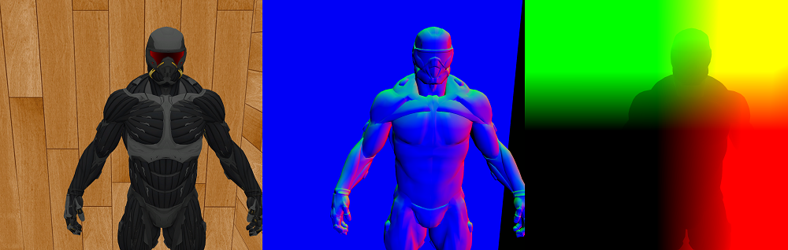
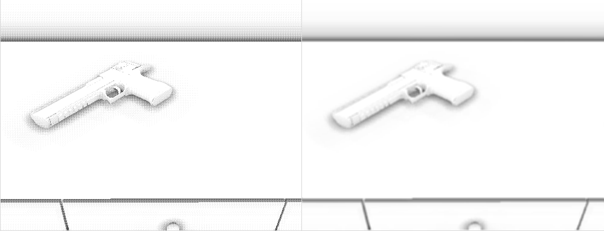
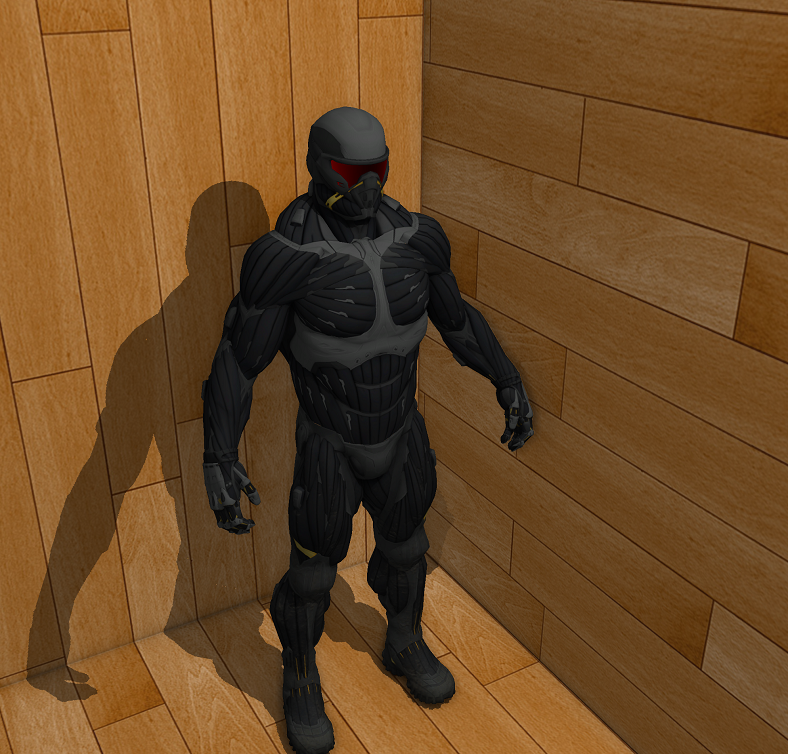

# Advanced Lighting and Particle System using OpenGL
## Project Details
The	project is	implemented	in	__Visual	Studio	2017__.	The	scene	consists	of	a textured cube whose interior is filled with three 3D Models: Nanosuit, Dresser and a Deagle. The barrel of deagle is lit with fire.	Navigation is similar to free roam of a first person camera. Move using WASD and change orientation using mouse.	Mouse	pointer	is	anchored	at	the	screen	center	and	won’t be	visible.	So	press	Esc	to	close	the	window. Refer the terminal window for changing various rendering params at run time.

- AdvancedLighting/EXEC folder contains the executable to run the project
- Helper	folder	contains	some	header	files	used	by	the	project.
- AdvancedLighting	folder	contains	the	Visual	Studio	2017	project	which has	the	source	code.
- AdvancedLighting/resources contains shaders, 3D Models and textures.

## Dependencies and Requirements
- GPU	with	at	least	OpenGL	4.3	support.	It	is	needed	for	compute shader	and	storage	shader	buffer	object. 
- GLFW3	library	for	OpenGL	context	and	window	creation. 
- GLAD	for	extension	loading. 
- GLM	for	linear	algebra. 
- Assimp	library	for	loading	3D	meshes. 

If	you	simply	wish	to	run	the	executable,	you	only	need	1st (refer last section). 

You will need to include and(or) link these libraries as well. You can do that on changing project properties after opening Visual Studio solution or it can be done directly by modifying AdvancedLighting/AdvancedLighting.vcxproj file. Modify lines 73-78 for include and lib paths. Lines 88 and 111 refer to linking of the lib files. For this project, I have directly used the C file of GLAD instead of lib or dll. Modify line 129 to refer to your glad.c file. If using library file, simply remove this line.

## Project Contents
* __Phong__ Illumination and Shading Model. Light source rotates in x-z plane and is positioned near the ceiling of cube. 
* __Face Culling__ is enabled for drawing 3D Models.
* __Screen Space Ambient Occlusion__ (SSAO): The sample kernels are stored in Shader Storage Buffer (OpenGL 4.3) as they might be changed due at run time via user input. SSAO is done in 3 rendering passes.
  * __G-Buffer__: Scene is rendered to a framebuffer with three texture attachments. Per pixel albedo (color), normal vector and position vector is stored in these textures as shown in the figure. Normal and position vectors are in view-space.
  
  * __SSAO pass__: Using normal and position texture from previous pass, occlusion value is evaluated for each pixel using a sample kernel and a random noise rotation.
  * __SSAO Blur pass__: This buffer is blurred to remove the grainy artifacts of previous pass. The figure below illustrates the process.
    
* __Shadow Map__: The shadow map (depth buffer w.r.t light source) is stored in a cubemap. For rendering to all six faces in a single pass, __Geometry Shader__ is used. This map is used for checking if a pixel is in shade (during illumination shader). The figure below shows shadows implemented with this process.

  
* __Particle System__: For drawing fire at Deagle tip, textured quadrilaterals (particles) are drawn in Instanced fashion. Each particle has the following data. This data is stored in a Shader Storage Buffer instead of Vertex Buffer as this data will be modified in the course of motion and Vertex Buffer can't be modified by a compute shader.
  1. aTime: Time since birth.
  2. aCenter: Position of Center.
  3. Initial Velocity. Acceleration is kept constant (0.1 in y direction). Can be modified in particle compute shader.
  4. aSize: Size of quadrilateral (particle).

  * __Particle Creation__: Particles are created by CPU for each complete render cycle. "lastUnused" particle(s) is the one whose data will be edited. The data is set accordingly to represent fresh particles (example: time = 0, size and velocity are sampled from uniform distribution) and is added to the buffer.
  * __Update Particles__: Update is done using a __Compute Shader__ (OpenGL 4.3 needed). Update, each particle's time (t+delta_t), positions, etc. If time > maxLife tag it as dead so that it is not rendered. As each update is independent, this operation can be easily implemented in GPU. This leads to a significant performance boost as compared to doing the update on CPU.
  * __Instancing__: Particles are drawn in an instanced fashion. Data used in the shader: aTime, aCenter, aSize. The texture is sampled from a __Smoke Atlas__, a texture having 8x8 tiles showing the state of smoke as time progresses. It is in resources/PartcleAtlas.png. So depending on the aTime value, vertex shader decides the texture coordinates to sample from. The following gif represents this system.

* __Screen Space Reflections__ (SSR): TODO

As particle system is the final shader, shadow has not currently been implemented for it.

## Resources
* __3D_Models__: Contains 3D models for dresser, Deagle, Cube and NanoSuit.
* __Shaders__:
  * scene.vs and scene.fs: Deferred Shading Pass. For rendering to G-Buffer.
  * ssao.vs and ssao.fs: SSAO second pass
  * ssao.vs and blur.fs: SSAO Blur pass
  * shadow.vs, shadow.gs, shadow.fs: Rendering to shadow Map.
  * ssao.vs and lighting.fs: Phong + stuff evaluated from previous passes.
  * particle.compute: Compute Shader for updating particles
  * particle.vs and particle.fs: Rendering of particles
  * ssao.vs and drawQuad.fs: For rendering intermediate stuff. Used for debugging.
* __SkyBox__: Needed for SSR (TODO).
* __args.txt__: Input arguments for project. 
* __ParticleAtlas.png__: Texture showing state of particle with time.

## Running the executable (EXEC folder)
* AdvancedLighting.exe is the __Windows 10__ executable of the __Visual Studio 2017__ project.
* assimp-vc140-mt.dll is dll for assimp library (needed for 3D model loading).
* The executable uses the "resources" folder for execution. Make sure that exe and dll are present in same directory as resources folder or it won't be able to locate the resources. For this, you may either copy the exe and dll to project folder or copy the resources folder to EXEC folder.
* Modify "resources/args.txt" to change various rendering params. Keep __lifeOfParticles * ScreenFrameRate <= NumberOfParticles__ otherwise the particles will die sooner.
* Shaders are loaded and compiled at run-time. So feel free to modify them according to your needs. Example: You can change Phong params in lighting.fs or change update equation in particle.compute
  

